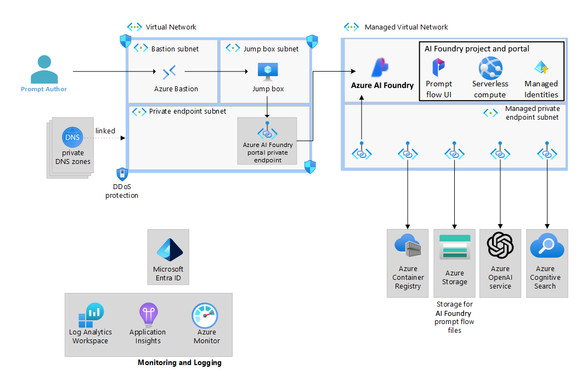
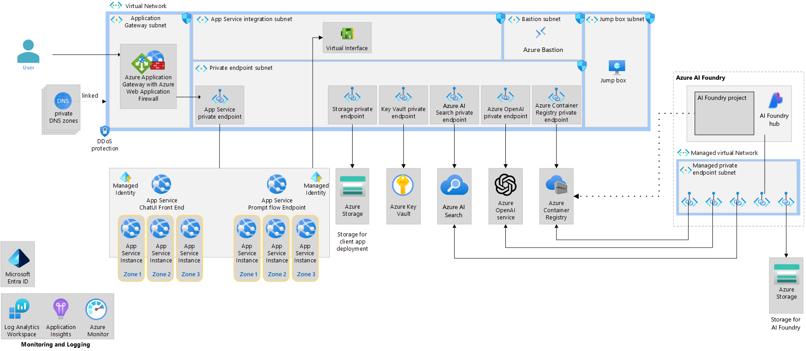

# Azure OpenAI end-to-end baseline reference implementation

This reference implementation illustrates an approach for authoring and running a chat application in a single region with prompt flow and Azure OpenAI. This repository supports the [Baseline OpenAI end-to-end chat reference architecture](https://learn.microsoft.com/en-us/azure/architecture/ai-ml/architecture/baseline-openai-e2e-chat) on Microsoft Learn and showcases a secure environment for authoring a chat flow and two options for deploying the flow:

- An Azure Machine Learning managed online endpoint in a managed virtual network.

  - If your application requires high availability and you favor using a managed online endpoint, it is recommended to extend this architecture by deploying multiple online endpoints behind a load balancer to improve resiliency.
- A network-isolated, zone-redundant, highly available deployment in Azure App Service.

The implementation will have you build and test a [prompt flow](https://microsoft.github.io/promptflow/) in an [Azure AI Studio](https://learn.microsoft.com/azure/ai-studio/how-to/prompt-flow) project and deploy the flow. You'll be exposed to common generative AI chat application characteristics such as:

- Creating prompts
- Querying data stores for grounding data
- Python code
- Calling language models (such as GPT models)

This implementation builds off the [basic implementation](https://github.com/Azure-Samples/openai-end-to-end-basic), and adds common production requirements such as:

- Network isolation
- Security
- Reliability

## Architecture

The implementation covers the following scenarios:

1. Authoring a flow - Authoring a flow using prompt flow in Azure AI Studio

1. Deploying a flow to managed compute behind an Azure Machine Learning endpoint - The deployment of the executable flow created in Azure AI Studio to managed online endpoint. The client UI that is hosted in Azure App Service accesses the deployed flow.

1. Deploying a flow to Azure App Service (Self-hosted option) - The deployment of an executable flow as a container to Azure App Service. The client UI that accesses the flow is also hosted in Azure App Service.

### Authoring a flow



The authoring architecture diagram illustrates how flow authors [connect to an Azure AI Studio through a private endpoint](https://learn.microsoft.com/azure/ai-studio/how-to/configure-private-link) in a virtual network. In this case, the author connects to the virtual network through Azure Bastion and a virtual machine. Connectivity to the virtual network is more commonly done in enterprises using private connectivity options like ExpressRoute or virtual network peering.

The diagram further illustrates how AI Studio is configured for [managed virtual network isolation](https://learn.microsoft.com/azure/ai-studio/how-to/configure-managed-network). With this configuration, a managed virtual network is created, along with managed private endpoints enabling connectivity to private resources such as the project's Azure Storage and Azure Container Registry. You can also create user-defined connections like private endpoints to connect to resources like Azure OpenAI service and Azure AI Search.

### Deploying a flow to Azure Machine Learning managed online endpoint


The Azure AI Studio deployment architecture diagram illustrates how a front-end web application, deployed into a [network-secured App Service](https://github.com/Azure-Samples/app-service-baseline-implementation), [connects to a managed online endpoint through a private endpoint](https://learn.microsoft.com/azure/ai-studio/how-to/configure-private-link) in a virtual network. Like the authoring flow, the diagram illustrates how the AI Studio project is configured for [managed virtual network isolation](https://learn.microsoft.com/azure/ai-studio/how-to/configure-managed-network). The deployed flow connects to required resources such as Azure OpenAI and Azure AI Search through managed private endpoints.

### Deploying a flow to Azure App Service (alternative)



The Azure App Service deployment architecture diagram illustrates how the same prompt flow is containerized and deployed to Azure App Service alongside the same front-end web application from the prior architecture. This solution is a completely self-hosted, externalized alternative to an Azure AI Studio managed online endpoint.

The flow is still authored in a network-isolated Azure AI Studio project. To deploy an App Service in this architecture, the flows need to be containerized and pushed to the Azure Container Registry that is accessible through private endpoints by the App Service.

### :recycle: Transitioning to Azure AI Studio

Azure patterns & practices team is transitioning this and related content from Azure Machine Learning workspaces to Azure AI Studio hub + projects. During this transition period some of the assets might be out of sync with each other technology wise. Architecturally, these two technologies are very similar to each other, even down to the resource provider level. Pardon our dust as we make this transition across the assets. Here is the current status:

| Asset | Workspace |
| :---- | :-------- |
| [Basic implementation](https://github.com/Azure-Samples/openai-end-to-end-basic) | :ballot_box_with_check: AI Studio project |
| [Basic architecture on Microsoft Learn](https://learn.microsoft.com/azure/architecture/ai-ml/architecture/basic-openai-e2e-chat) | :ballot_box_with_check: AI Studio project |
| Baseline implementation *(this repo)* | :ballot_box_with_check: AI Studio project |
| [Baseline architecture on Microsoft Learn](https://learn.microsoft.com/azure/architecture/ai-ml/architecture/baseline-openai-e2e-chat) | :ballot_box_with_check: AI Studio project |
| [Azure landing zone implementation](https://github.com/Azure-Samples/azure-openai-chat-baseline-landing-zone) | :white_square_button: AML workspace |
| [Azure landing zone architecture on Microsoft Learn](https://learn.microsoft.com/azure/architecture/ai-ml/architecture/azure-openai-baseline-landing-zone) | :white_square_button: AML workspace |

## Deployment guide

Follow these instructions to deploy this example to your Azure subscription, try out what you've deployed, and learn how to clean up those resources.

### Prerequisites

- An [Azure subscription](https://azure.microsoft.com/free/)

  - The subscription must have the following resource providers [registered](https://learn.microsoft.com/azure/azure-resource-manager/management/resource-providers-and-types#register-resource-provider).

    - `Microsoft.AlertsManagement`
    - `Microsoft.CognitiveServices`
    - `Microsoft.Compute`
    - `Microsoft.ContainerRegistry`
    - `Microsoft.KeyVault`
    - `Microsoft.Insights`
    - `Microsoft.MachineLearningServices`
    - `Microsoft.ManagedIdentity`
    - `Microsoft.Network`
    - `Microsoft.OperationalInsights`
    - `Microsoft.Storage`
    - `Microsoft.Web`

  - The subscription selected must have the following quota available in the location you'll select to deploy this implementation.

    - Azure OpenAI: Standard, GPT-35-Turbo, 25K TPM
    - Storage Accounts: 2 instances
    - App Service Plans: P1v3 (AZ), 3 instances
    - Azure DDoS protection plan: 1
    - Standard, static Public IP Addresses: 2
    - Standard DASv4 Family Cluster Dedicated vCPUs for machine learning: 8

- Your deployment user must have the following permissions at the subscription scope.

  - Ability to assign [Azure roles](https://learn.microsoft.com/azure/role-based-access-control/built-in-roles) on newly created resource groups and resources. (E.g. `User Access Administrator` or `Owner`)
  - Ability to purge deleted AI services resources. (E.g. `Contributor` or `Cognitive Services Contributor`)

- The [Azure CLI installed](https://learn.microsoft.com/cli/azure/install-azure-cli)

  If you're executing this from WSL, be sure the Azure CLI is installed in WSL and is not using the version installed in Windows. `which az` should show `/usr/bin/az`.

- The [OpenSSL CLI](https://docs.openssl.org/3.3/man7/ossl-guide-introduction/#getting-and-installing-openssl) installed.

### 1. :rocket: Deploy the infrastructure

The following steps are required to deploy the infrastructure from the command line.

1. In your shell, clone this repo and navigate to the root directory of this repository.

   ```bash
   git clone https://github.com/Azure-Samples/openai-end-to-end-baseline
   cd openai-end-to-end-baseline
   ```

1. Log in and set your target subscription.

   ```bash
   az login
   az account set --subscription xxxxx
   ```

1. Obtain the App gateway certificate

   Azure Application Gateway includes support for secure TLS using Azure Key Vault and managed identities for Azure resources. This configuration enables end-to-end encryption of the network traffic using standard TLS protocols. For production systems, you should use a publicly signed certificate backed by a public root certificate authority (CA). Here, we will use a self-signed certificate for demonstration purposes.

   - Set a variable for the domain used in the rest of this deployment.

     ```bash
     DOMAIN_NAME_APPSERV="contoso.com"
     ```

   - Generate a client-facing, self-signed TLS certificate.

     :warning: Do not use the certificate created by this script for actual deployments. The use of self-signed certificates are provided for ease of illustration purposes only. For your App Service solution, use your organization's requirements for procurement and lifetime management of TLS certificates, *even for development purposes*.

     Create the certificate that will be presented to web clients by Azure Application Gateway for your domain.

     ```bash
     openssl req -x509 -nodes -days 365 -newkey rsa:2048 -out appgw.crt -keyout appgw.key -subj "/CN=${DOMAIN_NAME_APPSERV}/O=Contoso" -addext "subjectAltName = DNS:${DOMAIN_NAME_APPSERV}" -addext "keyUsage = digitalSignature" -addext "extendedKeyUsage = serverAuth"
     openssl pkcs12 -export -out appgw.pfx -in appgw.crt -inkey appgw.key -passout pass:
     ```

   - Base64 encode the client-facing certificate.

     :bulb: No matter if you used a certificate from your organization or generated one from above, you'll need the certificate (as `.pfx`) to be Base64 encoded for proper storage in Key Vault later.

     ```bash
     APP_GATEWAY_LISTENER_CERTIFICATE_APPSERV=$(cat appgw.pfx | base64 | tr -d '\n')
     echo APP_GATEWAY_LISTENER_CERTIFICATE_APPSERV: $APP_GATEWAY_LISTENER_CERTIFICATE_APPSERV
     ```

1. Set the deployment location to one that [supports availability zones](https://learn.microsoft.com/azure/reliability/availability-zones-service-support) and has available quota.

   This deployment has been tested in the following locations: `eastus`, `eastus2`, `switzerlandnorth`. You might be successful in other locations as well.

   ```bash
   LOCATION=eastus2
   ```

1. Set the base name value that will be used as part of the Azure resource names for the resources deployed in this solution.

   ```bash
   BASE_NAME=<base resource name, between 6 and 8 lowercase characters, all DNS names will include this text, so it must be unique.>
   ```

1. Create a resource group and deploy the infrastructure.

   You will be prompted for an admin password for the jump box; it must satisfy the [complexity requirements for Windows](https://learn.microsoft.com/windows/security/threat-protection/security-policy-settings/password-must-meet-complexity-requirements).

   :clock8: *This might take about 25 minutes.*

   ```bash
   RESOURCE_GROUP=rg-chat-baseline-${LOCATION}
   az group create -l $LOCATION -n $RESOURCE_GROUP

   PRINCIPAL_ID=$(az ad signed-in-user show --query id -o tsv)

   az deployment group create -f ./infra-as-code/bicep/main.bicep \
     -g $RESOURCE_GROUP \
     -p appGatewayListenerCertificate=${APP_GATEWAY_LISTENER_CERTIFICATE_APPSERV} \
     -p baseName=${BASE_NAME} \
     -p yourPrincipalId=${PRINCIPAL_ID}
   ```

1. Apply workaround for Azure AI Studio not deploying its managed network.

   Azure AI Studio tends to delay deploying its managed network, which causes problems when trying to access Azure AI Studio's portal experience in the next step. Your final IaC implementation must account for this.

   :clock8: *This might take about 15 minutes.*

   ```bash
   az extension add --name ml
   az ml workspace provision-network -n aihub-${BASE_NAME} -g $RESOURCE_GROUP
   ```

### 2. Deploy a prompt flow from Azure AI Studio

To test this scenario, you'll be deploying a pre-built prompt flow. The prompt flow is called "Chat with Wikipedia" which adds a Wikipedia search as grounding data. Deploying a prompt flow requires data plane and control plane access. In this architecture, a network perimeter is established, and you must interact with Azure AI Studio and its resources from the network.

1. Connect to the virtual network via [Azure Bastion and the jump box](https://learn.microsoft.com/azure/bastion/bastion-connect-vm-rdp-windows#rdp) or through a force-tunneled VPN or virtual network peering that you manually configure.

   The username for the Windows jump box deployed in this solution is `vmadmin`.

   | :computer: | Unless otherwise noted, the following steps are performed from the jump box or from your VPN-connected workstation. The instructions are written as if you are using the provided Windows jump box.|
   | :--------: | :------------------------- |

1. Open the Azure portal to your subscription and navigate to the Azure AI project named **aiproj-chat** in your resource group.

   You'll need to sign in if this is the first time you are connecting through the jump box.

1. Open Azure AI Studio by clicking the **Launch studio** button.

   This will take you directly into the 'Chat with Wikipedia project'. In the future, you can find all your AI Studio hubs and projects by going to <https://ai.azure.com>.

1. Click on **Prompt flow** in the left navigation.

1. On the **Flows** tab, click **+ Create**.

1. Under **Explore gallery**, find "Chat with Wikipedia" and click **Clone**.

1. Set the Folder name to `chat_wiki` and click **Clone**.

   This copies a starter prompt flow template into your Azure Files storage account. This action is performed by the managed identity of the project. After the files are copied, then you're directed to a prompt flow editor. That editor experience uses your own identity for access to Azure Files.

   :bug: Occasionally, you might receive the following error:

   > CloudDependencyPermission: This request is not authorized to perform this operation using this permission. Please grant workspace/registry read access to the source storage account.

   If this happens, simply choose a new folder name and click the **Clone** button again. You'll need to remember the new folder name to adjust the instructions later.

1. Connect the `extract_query_from_question` prompt flow step to your Azure OpenAI model deployment.

   - For **Connection**, select 'aoai' from the dropdown menu. This is your deployed Azure OpenAI instance.
   - For **deployment_name**, select 'gpt35' from the dropdown menu. This is the model you've deployed in that Azure OpenAI instance.
   - For **response_format**, select '{"type":"text"}' from the dropdown menu

1. Also connect the `augmented_chat` prompt flow step to your Azure OpenAI model deployment.

   - For **Connection**, select the same 'aoai' from the dropdown menu.
   - For **deployment_name**, select the same 'gpt35' from the dropdown menu.
   - For **response_format**, also select '{"type":"text"}' from the dropdown menu.

1. Work around a telemetry issue that results in an error at the point of inferencing.

   At the time of this writing, there is a prompt flow + OpenTelemetry related [bug](https://github.com/microsoft/promptflow/issues/3751) that manifests itself after the prompt flow is deployed to a managed online endpoint. Proper requests to the `/score` endpoint result in an error response of `unsupported operand type(s) for +: 'NoneType' and 'NoneType'`.

   This issue should be resolved once default containers for managed online compute for running prompt flows are shipped with promptflow-tracing >= 1.16.1. As of late October 2024, the containers are still using 1.15.x. Until those packages are updated in the container, you'll need to perform the following steps.

   1. Click the **Raw file mode** toggle at the top of the flow and click **Save** if it asked to save.
   1. At the very bottom of the `flow.diag.yml` file, add the following two lines:

      ```yml
      environment_variables:
        PF_DISABLE_TRACING: true
      ```

   1. Click **Save** on the file.
   1. Untoggle the **Raw file mode** to get back to the flow designer.

1. Click **Save** on the whole flow.

### 3. Test the prompt flow from Azure AI Studio

Here you'll test your flow by invoking it directly from the Azure AI Studio. The flow still requires you to bring compute to execute it from. The compute you'll use when in the portal is the default *Serverless* offering, which is only used for portal-based prompt flow experiences. The interactions against Azure OpenAI are performed by your identity; the bicep template has already granted your user data plane access. The Serverless compute is run from the managed virtual network and is beholden to the egress network rules defined.

1. Click **Start compute session**.

1. :clock8: Wait for that button to change to *Compute session running*. This might take about ten minutes.

   *Do not advance until the serverless compute is running.*

1. Click the enabled **Chat** button on the UI.

1. Enter a question that would require grounding data through recent Wikipedia content, such as a notable current event.

1. A grounded response to your question should appear on the UI.

### 4. Deploy the prompt flow to an Azure Machine Learning managed online endpoint

Here you'll take your tested flow and deploy it to a managed online endpoint using Azure AI Studio.

1. Click the **Deploy** button in the UI.

1. Choose **Existing** endpoint and select the one called *ept-chat-BASE_NAME*.

1. Set the following Basic settings and click **Next**.

   - **Deployment name**: ept-chat-deployment
   - **Virtual machine**: Choose a small virtual machine size from which you have quota. 'Standard_D2as_v4' is plenty for this sample.
   - **Instance count**: 3. This is the recommended minimum count.
   - **Inferencing data collection**: Enabled

1. Set the following Advanced settings and click **Next**.

   - **Deployment tags**: You can leave blank.
   - **Environment**: Use environment of current flow definition.
   - **Application Insights diagnostics**: Enabled

1. Ensure the Output & connections settings are still set to the same connection name and deployment name as configured in the prompt flow and click **Next**.

1. Click the **Create** button.

   There is a notice on the final screen that says:

   > Following connection(s) are using Microsoft Entra ID based authentication. You need to manually grant the endpoint identity access to the related resource of these connection(s).
   > - aoai

   This has already been taken care of by your IaC deployment. The managed online endpoint identity already has this permission to Azure OpenAI, so there is no action for you to take.

1. :clock9: Wait for the deployment to finish creating.

   The deployment can take over 15 minutes to create. To check on the process, navigate to the **Deployments** screen using the link in the left navigation. If you are asked about unsaved changes, just click **Confirm**.

   Eventually 'ept-chat-deployment' will be on this list and then eventually the deployment will be listed with a State of 'Succeeded' and have 100% traffic allocation. Use the **Refresh** button as needed.

   *Do not advance until this deployment is complete.*

### 5. Test the Azure Machine Learning online endpoint from the network

As a quick checkpoint of progress, you should test to make sure your Azure Machine Learning managed online endpoint is able to be called from the network. These steps test the network and authorization configuration of that endpoint.

1. Install some tooling on the jump box.

   Since your jump box is acting as a developer workstation and build agent, you'll need some tooling installed. Install the Azure CLI and Miniconda. The instructions that follow can be run from new Terminal session to install both.

   ```powershell
   winget install -e --id=Microsoft.AzureCLI
   winget install -e --id=Anaconda.Miniconda3
   ```

   Restart your terminal to get `az` included in your path and install the ML Azure CLI extension.

   ```powershell
   az extension add --name ml
   ```

1. Close your terminal.

1. Open an **Anaconda PowerShell Prompt** instance from the Start Menu.

   You'll need a PowerShell prompt with a Python environnment available eventually in these instructions. It's best to open it now to only need to set environment variables once.

1. Log in through the Azure CLI so the terminal has access to your subscription.

   If prompted, choose **No, sign in to this app only**.

1. Carry over some context from your workstation.

   ```powershell
   $BASE_NAME="SET TO SAME VALUE YOU USED BEFORE"
   ```

   ```powershell
   $LOCATION="SET TO THE SAME VALUE YOU USED BEFORE"
   ```

   ```powershell
   $RESOURCE_GROUP="rg-chat-baseline-${LOCATION}"
   ```

1. Execute an HTTP request to the online endpoint.

   Feel free to adjust for your own question.

   ```powershell
   New-Item "request.json" -ItemType File -Value '{"question":"Who were the top three medal winning countries in the 2024 Paris Olympics?"}'
   az ml online-endpoint invoke -w aiproj-chat -n ept-chat-${BASE_NAME} -g $RESOURCE_GROUP -r request.json
   ```

1. A grounded response to your question should appear in the output. This test emulates any compute platform that is on the virtual network that would be calling the `/score` API on the managed online endpoint.

### 6. Publish the chat front-end web app

Workloads build chat functionality into an application. Those interfaces usually call APIs which in turn call into prompt flow. This implementation comes with such an interface. You'll deploy it to Azure App Service using its [run from package](https://learn.microsoft.com/azure/app-service/deploy-run-package) capabilities.

In a production environment, you use a CI/CD pipeline to:

- Build your web application
- Create the project zip package
- Upload the zip file to your storage account from compute that is in or connected to the workload's virtual network.

For this deployment guide, you'll continue using your jump box (or VPN-connected workstation) to simulate part of that process.

1. Using the same Powershell terminal session from previous steps, download the web UI.

   ```powershell
   Invoke-WebRequest -Uri https://raw.githubusercontent.com/Azure-Samples/openai-end-to-end-baseline/refs/heads/main/website/chatui.zip -OutFile chatui.zip
   ```

   If you are using a VPN-connected workstation, download the same zip to your workstation.

1. Upload the web application to Azure Storage, where the web app will load the code from.

   ```powershell
   az storage blob upload -f chatui.zip --account-name "st${BASE_NAME}" --auth-mode login -c deploy -n chatui.zip
   ```

1. Restart the web app to launch the site. *(This can be done from your workstation or the jump box.)*

   ```powershell
   az webapp restart --name "app-${BASE_NAME}" --resource-group "${RESOURCE_GROUP}"
   ```

### 7. Test the deployed application that calls into the Azure Machine Learning managed online endpoint

This section will help you to validate that the workload is exposed correctly and responding to HTTP requests. This will validate that traffic is flowing through Application Gateway, into your Web App, and from your Web App, into the Azure Machine Learning managed online endpoint, which contains the hosted prompt flow. The hosted prompt flow will interface with Wikipedia for grounding data and Azure OpenAI for generative responses.

| :computer: | Unless otherwise noted, the following steps are all performed from your original workstation, not from the jump box. |
| :--------: | :------------------------- |

1. Get the public IP address of the Application Gateway.

   ```bash
   # Query the Azure Application Gateway Public IP
   APPGW_PUBLIC_IP=$(az network public-ip show -g $RESOURCE_GROUP -n "pip-$BASE_NAME" --query [ipAddress] --output tsv)
   echo APPGW_PUBLIC_IP: $APPGW_PUBLIC_IP
   ```

1. Create an `A` record for DNS.

   > :bulb: You can simulate this via a local hosts file modification.  Alternatively, you can add a real DNS entry for your specific deployment's application domain name if permission to do so.

   Map the Azure Application Gateway public IP address to the application domain name. To do that, please edit your hosts file (`C:\Windows\System32\drivers\etc\hosts` or `/etc/hosts`) and add the following record to the end: `${APPGW_PUBLIC_IP} www.${DOMAIN_NAME_APPSERV}` (e.g. `50.140.130.120  www.contoso.com`)

1. Browse to the site (e.g. <https://www.contoso.com>).

   > :bulb: It may take up to a few minutes for the App Service to start properly. Remember to include the protocol prefix `https://` in the URL you type in your browser's address bar. A TLS warning will be present due to using a self-signed certificate. You can ignore it or import the self-signed cert (`appgw.pfx`) to your user's trusted root store.

1. Try it out!

   Once you're there, ask your solution a question. Your question should involve something that would only be known if the RAG process included content from Wikipedia such as recent data or events.

### 8. Rehost the prompt flow in Azure App Service

This is a second option for deploying the prompt flow code. With this option, you deploy the flow to Azure App Service instead of the managed online endpoint.

You will need access to the prompt flow files for this experience, since we'll be building a container out of them. While you could download them from your jump box and transfer them to your workstation (through git or though .zip), these instructions will just use the jump box as your prompt flow development environment. Using the jump box again simulates a build agent in the network. To perform these build and deploy tasks, you'll need to install some developer tools on the jump box.

| :computer: | Unless otherwise noted, the following steps are all performed from the jump box or from your VPN-connected workstation. |
| :--------: | :------------------------- |

1. From your *existing* **Anaconda PowerShell Prompt** instance, start a conda session and install the promptflow tools (pf CLI).

   ```powershell
   conda create -y --name pf python=3.12
   conda activate pf

   pip install promptflow[azure] promptflow-tools bs4
   ```

1. Open the Prompt flow UI again in your Azure AI Studio project.

1. Expand the **Files** tab in the upper-right pane of the UI.

1. Click on the download icon to download the flow as a zip file.

1. Unzip the prompt flow zip file you downloaded.

   *Ensure this file name is set to the directory name you used when first cloning this prompt flow.*

   ```powershell
   cd Downloads
   Expand-Archive chat_wiki.zip
   cd chat_wiki
   ```

1. Add packages to requirements.txt, which ensures they are installed in your container.

   ```powershell
   Add-Content requirements.txt -Value @'
   promptflow[azure]
   promptflow-tools
   python-dotenv
   bs4
   '@
   ```

1. Create a file for the Azure OpenAI connection named **aoai.yaml** and register it.

   ```powershell
   New-Item aoai.yaml -ItemType File -Value @'
   $schema: https://azuremlschemas.azureedge.net/promptflow/latest/AzureOpenAIConnection.schema.json
   name: aoai
   type: azure_open_ai
   api_base: "${env:OPENAICONNECTION_API_BASE}"
   api_type: "azure"
   api_version: "2024-02-01"
   auth_mode: "meid_token"
   '@

   pf connection create -f aoai.yaml
   ```

   > :bulb: The App Service is configured with App Settings that surface as environment variables for ```OPENAICONNECTION_API_BASE```.

1. Bundle the prompt flow to support creating a container image.

   ```bash
   pf flow build --source ./ --output dist --format docker
   ```

   The following code will create a directory named 'dist' with a Dockerfile and all the required flow code files.

1. Build the container image and push it to your Azure Container Registry.

   ```powershell
   cd dist

   $NAME_OF_ACR="cr${BASE_NAME}"
   $ACR_CONTAINER_NAME="aoai"
   $IMAGE_NAME="wikichatflow"
   $IMAGE_TAG="1.0"
   $FULL_IMAGE_NAME="${ACR_CONTAINER_NAME}/${IMAGE_NAME}:${IMAGE_TAG}"
   
   az acr build --agent-pool imgbuild -t $FULL_IMAGE_NAME -r $NAME_OF_ACR .
   ```

1. Set the container image on the Web App that will be hosting the prompt flow.

   ```powershell
   $PF_APP_SERVICE_NAME="app-$BASE_NAME-pf"
   $ACR_IMAGE_NAME="${NAME_OF_ACR}.azurecr.io/${FULL_IMAGE_NAME}"

   az webapp config container set -n $PF_APP_SERVICE_NAME -g $RESOURCE_GROUP -i $ACR_IMAGE_NAME -r "https://${NAME_OF_ACR}.azurecr.io"
   az webapp deployment container config -e true -n $PF_APP_SERVICE_NAME -g $RESOURCE_GROUP
   ```

1. Modify the configuration setting in the App Service that has the chat UI and point it to your deployed prompt flow endpoint hosted in App Service instead of the managed online endpoint.

   ```powershell
   $UI_APP_SERVICE_NAME="app-$BASE_NAME"
   $ENDPOINT_URL="https://$PF_APP_SERVICE_NAME.azurewebsites.net/score"

   az webapp config appsettings set --name $UI_APP_SERVICE_NAME --resource-group $RESOURCE_GROUP --settings chatApiEndpoint=$ENDPOINT_URL
   az webapp restart --name $UI_APP_SERVICE_NAME --resource-group $RESOURCE_GROUP
   ```

## :checkered_flag: Try it out. Test the final deployment

| :computer: | Unless otherwise noted, the remaining steps are performed from your original workstation, not from the jump box. |
| :--------: | :------------------------- |

Browse to the site (e.g. <https://www.contoso.com>) once again. Once there, ask your solution a question. Like before, your question should involve something that would only be known if the RAG process included content from Wikipedia such as recent data or events.

In this final configuration, your chat UI is interacting with the prompt flow code hosted in another Web App in your Azure App Service instance. Your Azure Machine Learning online endpoint is not used, and Wikipedia and Azure OpenAI are being called right from your prompt flow Web App.

## :broom: Clean up resources

Most Azure resources deployed in the prior steps will incur ongoing charges unless removed. This deployment is typically over $100 a day, mostly due to Azure DDoS Protection and Azure AI Studio's managed network's firewall. Promptly delete resources when you are done using them.

Additionally, a few of the resources deployed go into soft delete status which may restrict the ability to redeploy another resource with the same name and may not release quota. It is best to purge any soft deleted resources once you are done exploring. Use the following commands to delete the deployed resources and resource group and to purge each of the resources with soft delete.

| :warning: | This will completely delete any data you may have included in this example. That data and this deployment will be unrecoverable. |
| :--------: | :------------------------- |

```bash
az group delete -n $RESOURCE_GROUP -y

# Purge the soft delete resources
az keyvault purge -n kv-${BASE_NAME} -l $LOCATION 
az cognitiveservices account purge -g $RESOURCE_GROUP -l $LOCATION -n oai-${BASE_NAME}
```

## Contributions

Please see our [Contributor guide](./CONTRIBUTING.md).

This project has adopted the [Microsoft Open Source Code of Conduct](https://opensource.microsoft.com/codeofconduct/). For more information see the [Code of Conduct FAQ](https://opensource.microsoft.com/codeofconduct/faq/) or contact <opencode@microsoft.com> with any additional questions or comments.

With :heart: from Azure Patterns & Practices, [Azure Architecture Center](https://azure.com/architecture).
