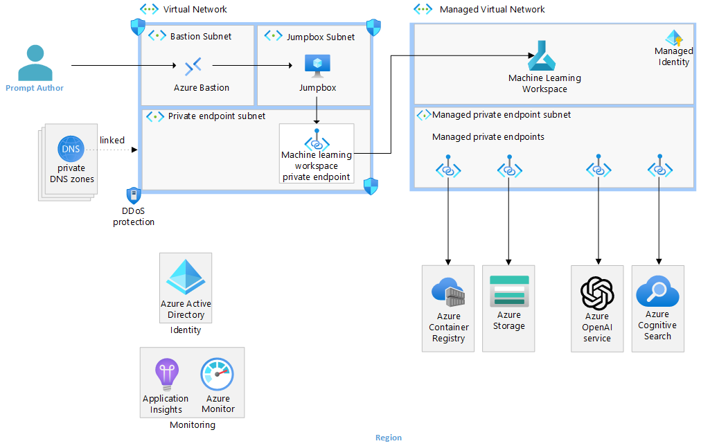
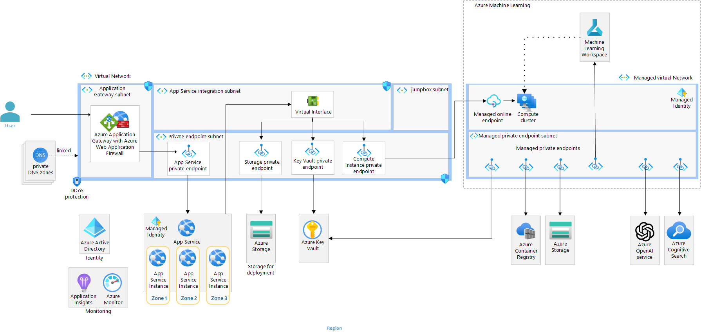
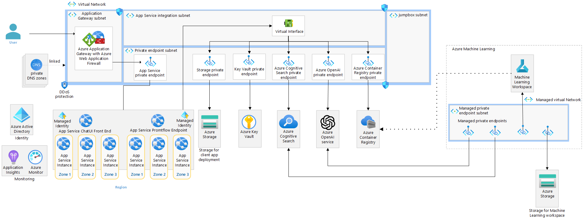

# Azure OpenAI end-to-end baseline reference implementation

TODO (P1): Update description

This reference implementation illustrates an approach for authoring and running a chat application in a single region with prompt flow and Azure OpenAI. This reference implementation showcases a secure environment for authoring a chat flow and two options for deploying the flow:

- An Azure Machine Learning managed online endpoint in a managed virtual network.
  - If your application requires high availability and you favor using a managed online endpoint, it is recommended to extend this architecture by deploying multiple online endpoints behind a load balancer to improve resiliency.
- A network-isolated, zone-redundant, highly available deployment in Azure App Service.

The implementation will have you build and test a [Prompt flow](https://microsoft.github.io/promptflow/) in an [Azure Machine Learning](https://azure.microsoft.com/products/machine-learning) workspace and deploy the flow. You'll be exposed to common generative AI chat application characteristics such as:

- Creating prompts
- Querying data stores for grounding data
- Python code
- Calling language models (such as GPT models)

This implementation builds off of the [basic implementation](https://github.com/Azure-Samples/openai-end-to-end-basic), and adds common production requirements such as:

- Network isolation
- Security
- Reliability

## Architecture

The implementation covers the following scenarios:

1. Authoring a flow - Authoring a flow using prompt flow in an Azure Machine Learning workspace
1. Deploying a flow to Azure Machine Learning (AML hosted option) - The deployment of an executable flow to an Azure Machine Learning online endpoint. The client UI that is hosted in Azure App Service accesses the deployed flow.
1. Deploying a flow to Azure App Service (Self-hosted option) - The deployment of an executable flow as a container to Azure App Service. The client UI that accesses the flow is also hosted in Azure App Service.

### Authoring a flow

TODO (P1): Update diagram and description



The authoring architecture diagram illustrates how flow authors [connect to an Azure Machine Learning Workspace through a private endpoint](https://learn.microsoft.com/azure/machine-learning/how-to-configure-private-link) in a virtual network. In this case, the author connects to the virtual network through Azure Bastion and a virtual machine jumpbox. Connectivity to the virtual network is more commonly done in enterprises through ExpressRoute or virtual network peering.

The diagram further illustrates how the Machine Learning Workspace is configured for [Workspace managed virtual network isolation](https://learn.microsoft.com/azure/machine-learning/how-to-managed-network). With this configuration, a managed virtual network is created, along with managed private endpoints enabling connectivity to private resources such as the workplace Azure Storage and Azure Container Registry. You can also create user-defined connections like private endpoints to connect to resources like Azure OpenAI Service and Azure AI Search (previously named Cognitive Search).

### Deploying a flow to Azure Machine Learning managed online endpoint

TODO (P1): Update diagram and description



The Azure Machine Learning deployment architecture diagram illustrates how a front-end web application, deployed into a [network-secured App Service](https://github.com/Azure-Samples/app-service-baseline-implementation), [connects to a managed online endpoint through a private endpoint](https://learn.microsoft.com/azure/machine-learning/how-to-configure-private-link) in a virtual network. Like the authoring flow, the diagram illustrates how the Machine Learning Workspace is configured for [Workspace managed virtual network isolation](https://learn.microsoft.com/azure/machine-learning/how-to-managed-network). The deployed flow is able to connect to required resources such as Azure OpenAI and Cognitive Search through managed private endpoints.

### Deploying a flow to Azure App Service (alternative)

TODO (P1): Update diagram and description



The Azure App Service deployment architecture diagram illustrates how the same prompt flow can be containerized and deployed to Azure App Service alongside the same front-end web application from the prior architecture. This solution is a completely self-hosted, externalized alternative to an Azure Machine Learning managed online endpoint.

The flow is still authored in a network-isolated Azure Machine Learning workspace. To deploy in App Service in this architecture, the flows need to be containerized and pushed to the Azure Container Registry that is accessible through private endpoints to the App Service.

### :recycle: Transitioning to Azure AI Studio

Azure patterns & practices team is transitioning this and related content from Azure Machine Learning workspaces to Azure AI Studio hub + projects. During ths transition period some of the assets might be out of sync with each other technology wise. Architecturally, these two technologies are very similar to each other, even down to the resource provider level. Pardon our dust as we make this transition across the assets. Here is the current status.

| Asset | Workspace |
| :---- | :-------- |
| [Basic implementation](https://github.com/Azure-Samples/openai-end-to-end-basic) | :ballot_box_with_check: AI Studio project |
| [Basic architecture on Microsoft Learn](https://learn.microsoft.com/azure/architecture/ai-ml/architecture/basic-openai-e2e-chat) | :ballot_box_with_check: AI Studio project |
| Baseline implementation *(this repo)* | :ballot_box_with_check: AI Studio project |
| [Baseline architecture on Microsoft Learn](https://learn.microsoft.com/azure/architecture/ai-ml/architecture/baseline-openai-e2e-chat) | :white_square_button: AML workspace |
| [Azure landing zone implementation](https://github.com/Azure-Samples/azure-openai-chat-baseline-landing-zone) | :white_square_button: AML workspace |
| [Azure landing zone architecture on Microsoft Learn](https://learn.microsoft.com/azure/architecture/ai-ml/architecture/azure-openai-baseline-landing-zone) | :white_square_button: AML workspace |

## Deployment guide

Follow these instructions to deploy this example to your Azure subscription, try out what you've deployed, and learn how to clean up those resources.

### Prerequisites

- An [Azure subscription](https://azure.microsoft.com/free/)

  - The subscription must have the following resource providers [registered](https://learn.microsoft.com/azure/azure-resource-manager/management/resource-providers-and-types#register-resource-provider).

    - `Microsoft.AlertsManagement`
    - `Microsoft.CognitiveServices`
    - `Microsoft.Compute`
    - `Microsoft.ContainerRegistry`
    - `Microsoft.KeyVault`
    - `Microsoft.Insights`
    - `Microsoft.MachineLearningServices`
    - `Microsoft.ManagedIdentity`
    - `Microsoft.Network`
    - `Microsoft.OperationalInsights`
    - `Microsoft.Storage`
    - `Microsoft.Web`

  - The subscription selected must have the following quota available in the location you'll select to deploy this implementation.

    - Azure OpenAI: Standard, GPT-35-Turbo, 25K TPM
    - Storage Accounts: Two instances
    - App Service Plans: P1v3 (AZ), three instances
    - TODO (P3): This is the list from "Basic" -- What's missing for Baseline?

- Your deployment user must have the following permissions at the subscription scope.

  - Ability to assign [Azure roles](https://learn.microsoft.com/azure/role-based-access-control/built-in-roles) on newly created resource groups and resources. (E.g. `User Access Administrator` or `Owner`)
  - Ability to purge deleted AI services resources. (E.g. `Contributor` or `Cognitive Services Contributor`)

- The [Azure CLI installed](https://learn.microsoft.com/cli/azure/install-azure-cli)

  If you're executing this from WSL, be sure the Azure CLI is installed in WSL and is not using the version installed in Windows. `which az` should show `/usr/bin/az`.

- The [OpenSSL CLI](https://docs.openssl.org/3.3/man7/ossl-guide-introduction/#getting-and-installing-openssl) installed.

- The [az Bicep tools installed](https://learn.microsoft.com/azure/azure-resource-manager/bicep/install)

### 1. :rocket: Deploy the infrastructure

The following steps are required to deploy the infrastructure from the command line.

1. In your shell, clone this repo and navigate to the root directory of this repository.

   ```bash
   git clone https://github.com/Azure-Samples/openai-end-to-end-baseline
   cd openai-end-to-end-baseline
   ```

1. Log in and set your target subscription.

   ```bash
   az login
   az account set --subscription xxxxx
   ```

1. Obtain the App gateway certificate

   Azure Application Gateway support for secure TLS using Azure Key Vault and managed identities for Azure resources. This configuration enables end-to-end encryption of the network traffic using standard TLS protocols. For production systems, you should use a publicly signed certificate backed by a public root certificate authority (CA). Here, we will use a self-signed certificate for demonstrational purposes.

   - Set a variable for the domain used in the rest of this deployment.

     ```bash
     DOMAIN_NAME_APPSERV="contoso.com"
     ```

   - Generate a client-facing, self-signed TLS certificate.

     :warning: Do not use the certificate created by this script for actual deployments. The use of self-signed certificates are provided for ease of illustration purposes only. For your App Service solution, use your organization's requirements for procurement and lifetime management of TLS certificates, _even for development purposes_.

     Create the certificate that will be presented to web clients by Azure Application Gateway for your domain.

     ```bash
     openssl req -x509 -nodes -days 365 -newkey rsa:2048 -out appgw.crt -keyout appgw.key -subj "/CN=${DOMAIN_NAME_APPSERV}/O=Contoso" -addext "subjectAltName = DNS:${DOMAIN_NAME_APPSERV}" -addext "keyUsage = digitalSignature" -addext "extendedKeyUsage = serverAuth"
     openssl pkcs12 -export -out appgw.pfx -in appgw.crt -inkey appgw.key -passout pass:
     ```

   - Base64 encode the client-facing certificate.

     :bulb: No matter if you used a certificate from your organization or generated one from above, you'll need the certificate (as `.pfx`) to be Base64 encoded for proper storage in Key Vault later.

     ```bash
     APP_GATEWAY_LISTENER_CERTIFICATE_APPSERV=$(cat appgw.pfx | base64 | tr -d '\n')
     echo APP_GATEWAY_LISTENER_CERTIFICATE_APPSERV: $APP_GATEWAY_LISTENER_CERTIFICATE_APPSERV
     ```

1. Set the deployment location to one that [supports availability zones](https://learn.microsoft.com/azure/reliability/availability-zones-service-support) and has available quota.

   TODO (P2): Verify for Baseline (this is copy from Basic)

   This deployment has been tested in the following locations: `australiaeast`, `eastus`, `eastus2`, `francecentral`, `japaneast`, `southcentralus`, `swedencentral`, `switzerlandnorth`, or `uksouth`. You might be successful in other locations as well.

   ```bash
   LOCATION=eastus2
   ```

1. Set the base name value that will be used as part of the Azure resource names for the resources deployed in this solution.

   ```bash
   BASE_NAME=<base resource name, between 6 and 8 lowercase characters, all DNS names will include this text, so it must be unique.>
   ```

1. Create a resource group and deploy the infrastructure.

   You will be prompted for an admin password for the jump box; it must satisfy the [complexity requirements for Windows](https://learn.microsoft.com/windows/security/threat-protection/security-policy-settings/password-must-meet-complexity-requirements).

   ```bash
   RESOURCE_GROUP=rg-chat-baseline-${LOCATION}
   az group create -l $LOCATION -n $RESOURCE_GROUP

   PRINCIPAL_ID=$(az ad signed-in-user show --query id -o tsv)

   # This takes about 30 minutes to run.
   az deployment group create -f ./infra-as-code/bicep/main.bicep \
     -g $RESOURCE_GROUP \
     -p appGatewayListenerCertificate=${APP_GATEWAY_LISTENER_CERTIFICATE_APPSERV} \
     -p baseName=${BASE_NAME} \
     -p yourPrincipalId=${PRINCIPAL_ID}
   ```

### 2. Deploy a prompt flow from Azure AI Studio

To test this architecture, you'll be deploying a pre-built prompt flow. The prompt flow is "Chat with Wikipedia" which adds a Wikipedia search as grounding data. Deploying a prompt flow requires data plane and control plane access. In this architecture, a network primeter is established, and you must be interacting with Azure AI Studio and its resources from the network.

1. Connect to the virtual network via Azure Bastion and the jump box or through a force-tunneled VPN or virtual network peering that you manually configure.

   The username for the jump box deployed in this solution is vmadmin`.

   | :computer: | Unless otherwise noted, all of the following steps are all performed from the jump box or from your VPN-connected workstation. |
   | :--------: | :------------------------- |

1. Open the Azure portal and navigate to the Azure AI project named **aiproj-chat** in your resource group.

   You'll need to sign in if this is the first time your connecting through the jump box.

1. Open Azure AI Studio by clicking the **Launch Studio** button.

   This will take you directly into the 'Chat with Wikipedia project'. In the future, you can find all of your AI Studio projects by going to <https://ai.azure.com/allProjects>.

1. Click on **Prompt flow** in the left navigation.

1. On the **Flows** tab, click **+ Create**.

1. Under Explore gallery, find "Chat with Wikipedia" and click **Clone**.

1. Set the Folder name to `chat_wiki` and click **Clone**.

   This copies a starter prompt flow template into your Azure Files storage account. This action is performed by the managed identity of the project. After the files are copied, then you're directed to a prompt flow editor. That editor experience uses your own identity for access to Azure Files.

TODO (P1): The UI produces an error when you do this for the first time. But if you do again (with a different directory name), it usally works just fine (sometimes it takes a few additional tries).  What is going on?

1. Connect the the `extract_query_from_question` prompt flow step to your Azure OpenAI model deployment.

   - For **Connection**, select 'aoai' from the dropdown menu. This is your deployed Azure OpenAI instance.
   - For **deployment_name**, select 'gpt35' from the dropdown menu. This is the model you've deployed in that Azure OpenAI instance.
   - For **response_format**, select '{"type":"text"}' from the dropdown menu

1. Also connect the the `augmented_chat` prompt flow step to your Azure OpenAI model deployment.

   - For **Connection**, select the same 'aoai' from the dropdown menu.
   - For **deployment_name**, select the same 'gpt35' from the dropdown menu.
   - For **response_format**, also select '{"type":"text"}' from the dropdown menu.

<!-- 
TODO (P2): BRING BACK IN IF NEEDED

1. Work around a telemetry issue that results in an error at the point of inferencing.

   At the time of this writing, there is a prompt flow + OpenTelemetry related [bug](https://github.com/microsoft/promptflow/issues/3751) that manifests itself after the prompt flow is deployed to a managed online endpoint. Proper requests to the `/score` endpoint result in an error response of `unsupported operand type(s) for +: 'NoneType' and 'NoneType'`. To correct that, perform the following steps.

   1. Open the **Files** view.
   1. Select 'requirements.txt'.
   1. The file should be empty, add one line containing just `promptflow-tracing>=1.16.1`.
   1. Click **Save only** and close the file.
-->

1. Click **Save** on the flow.

### 3. Test the prompt flow from Azure AI Studio

Here you'll test your flow by invoking it directly from the Azure AI Studio. The flow still requires you to bring compute to execute it from. The compute you'll use when in the portal is the default *Serverless* offering, which is only used for portal-based prompt flow experiences. The interactions against Azure OpenAI are performed by your identity; the bicep template has already granted your user data plane access. The Serverless compute is run from the managed virtual network and is beholden to the egress network rules defined.

1. Click **Start compute session**.

1. :clock8: Wait for that button to change to *Compute session running*. This may take about five minutes.

<!-- TODO (P2): BRING BACK IN IF NEEDED
   If you get an warning related to pip and dependency resolver, this is because of the temporary workaround you followed in the prior steps, this is safe to ignore.
-->
   *Do not advance until the serverless compute is running.*

1. Click the enabled **Chat** button on the UI.

1. Enter a question that would require grounding data through recent Wikipedia content, such as a notable current event.

1. A grounded response to your question should appear on the UI.

### 4. Deploy the Prompt flow to an Azure Machine Learning managed online endpoint

Here you'll take your tested flow and deploy it to a managed online endpoint.

1. Click the **Deploy** button in the UI.

1. Choose **Existing** endpoint and select the one called *ept-chat-BASE_NAME*.

1. Set the following Basic settings, and click **Next**.

   - **Deployment name**: ept-chat-deployment
   - **Virtual machine**: Choose a small virtual machine size from which you have quota. 'Standard_D2as_v4' is plenty for this sample.
   - **Instance count**: 3. This is the recommended minimum count.
   - **Inferencing data collection**: Enabled

1. Set the following Advanced settings, and click **Next**.

   - **Deployment tags**: You can leave blank.
   - **Environment**: Use environment of current flow definition.
   - **Application Insights diagnostics**: Enabled

1. Ensure the Output & connections settings are still set to the same connection name and deployment name as configured in the Prompt flow, and click **Next**.

1. Click the **Create** button.

   There is a notice on the final screen that says:

   > Following connection(s) are using Microsoft Entra ID based authentication. You need to manually grant the endpoint identity access to the related resource of these connection(s).
   > - aoai

   This has already been taken care of by your IaC deployment. The managed online endpoint identity already has this permission to Azure OpenAI, so there is no action for you to take.

1. :clock9: Wait for the deployment to finish creating.

   The deployment can take over ten minutes to create. To check on the process, navigate to the **Deployments** screen using the link in the left navigation. Eventually 'ept-chat-deployment' will be on this list and then eventually the deployment will be listed with a State of 'Succeeded'. Use the **Refresh** button as needed.

   *Do not advance until this deployment is complete.*

TODO (P2 - Dost): A `curl`-style test from the jumpbox would be pretty nice here. Maybe CLI/SDK call?  Would involve installing things though on the jump box.  The Basic allows you to test from the portal, but Azure AI Studio doesn't support that (for some odd reason) when private networking is established.  Maybe `az ml online-endpoint invoke` since AZ CLI is installed on the jump box?

### 5. Publish the chat front-end web app

Workloads build chat functionality into an application. Those interfaces usually call APIs which in turn call into Prompt flow. This implementation comes with such an interface. You'll deploy it to Azure App Service using its [run from package](https://learn.microsoft.com/azure/app-service/deploy-run-package) capabilities.

In a production environment, you use a CI/CD pipeline to:

- Build your application
- Create the project zip package
- Upload the zip file to your storage account from compute that is in or connected to the workload's virtual network.

For this deployment guide, you'll be using your your jump box (or VPN-connected workstation) to simulate part of that process.

1. Install Azure CLI on your jump box (skip if using your VPN connected workstation)

   TODO (P2): Can we install az cli as part of the bootstrapping of the VM?

1. Log in using the AZ CLI.

   If prompted, choose "No, sign in to this app only."

1. Download the web UI from a PowerShell terminal.

   ```powershell
   Invoke-WebRequest -Uri https://raw.githubusercontent.com/Azure-Samples/openai-end-to-end-baseline/refs/heads/main/website/chatui.zip -OutFile chatui.zip
   ```

   If you are using a VPN-connected workstation, download the same zip to your workstation.

1. Upload the web application to Azure Storage, where the web app will load the code from.

   ```powershell
   $BASE_NAME="SET TO SAME VALUE YOU USED BEFORE"
   $LOCATION="SET TO THE SAME VALUE YOU USED BEFORE"

   az storage blob upload -f chatui.zip --account-name "st${BASE_NAME}" --auth-mode login -c deploy -n chatui.zip
   ```

1. Restart the web app to launch the site.

   ```powershell
   az webapp restart --name "app-${BASE_NAME}" --resource-group "rg-chat-baseline-${LOCATION}"
   ```

### 6. Test the deployed application that calls into the Azure Machine Learning managed online endpoint

This section will help you to validate that the workload is exposed correctly and responding to HTTP requests. This will validate that traffic is flowing through Application Gateway, into your Web App, and from your Web App, into the Azure Machine Learning managed online endpoint, which contains the hosted prompt flow. The hosted prompt flow will interface with Wikipedia for grounding data and Azure OpenAI for generative responses.

| :computer: | Unless otherwise noted, all of the **following steps are all performed from your original workstation**, not from the jump box. |
| :--------: | :------------------------- |

1. Get the public IP address of the Application Gateway.

   ```bash
   # query the Azure Application Gateway Public IP
   APPGW_PUBLIC_IP=$(az network public-ip show --resource-group $RESOURCE_GROUP --name "pip-$BASE_NAME" --query [ipAddress] --output tsv)
   echo APPGW_PUBLIC_IP: $APPGW_PUBLIC_IP
   ```

1. Create an `A` record for DNS.

   > :bulb: You can simulate this via a local hosts file modification.  Alternatively, you can add a real DNS entry for your specific deployment's application domain name if permission to do so.

   Map the Azure Application Gateway public IP address to the application domain name. To do that, please edit your hosts file (`C:\Windows\System32\drivers\etc\hosts` or `/etc/hosts`) and add the following record to the end: `${APPGW_PUBLIC_IP} www.${DOMAIN_NAME_APPSERV}` (e.g. `50.140.130.120  www.contoso.com`)

1. Browse to the site (e.g. <https://www.contoso.com>).

   > :bulb: It may take up to a few minutes for the App Service to start properly. Remember to include the protocol prefix `https://` in the URL you type in your browser's address bar. A TLS warning will be present due to using a self-signed certificate. You can ignore it or import the self-signed cert (`appgw.pfx`) to your user's trusted root store.

TODO: Stopped here

1. Try it out!

   Once you're there, ask your solution a question. Like before, you question should ideally involve recent data or events, something that would only be known by the RAG process including content from Wikipedia.

### 7. Rehost the prompt flow in Azure App Service

TODO (P1 - Bilal): Can Azure AI Studio produce this image for us?  If so, how?  Can the prompt flow go into the Models catalog and get pulled from there?

This is a second option for deploying the flow. With this option, you deploy the flow to Azure App Service instead of the managed online endpoint. At a high-level, you must do the following:

- Prerequisites - Ensure you have the prerequisites
- Download your flow - Download the flow from the Machine Learning Workspace
- Build the flow - Use the ```pf``` CLI to build your flow
- Build and push the image - Containerize the flow and push to your Azure Container Registry
- Publish the image to Azure App Service

#### Prerequisites for this option

The following are the requirements for building the image, pushing to ACR, and deploying to Azure App Service:

- az CLI
- Python
- Anaconda
- Promptflow pf CLI

Below are commands to create and activate a conda environment and install the promptflow tools. See [Set up your dev environment](https://microsoft.github.io/promptflow/how-to-guides/quick-start.html#set-up-your-dev-environment) for more information.

```bash
conda create --name pf python=3.11.4
conda activate pf
pip install promptflow promptflow-tools

# You will need to install the following if you build the docker image locally
pip install keyrings.alt
pip install bs4
```

#### Download your flow

1. Open the prompt flow UI in Azure Machine Learning Studio
1. Expand the 'Files' tab in the right pane of the UI
1. Click on the download icon to download the flow as a zip file

> :bulb: If you are using a jumpbox to connect to Azure Machine Learning workspace, when you download the flow, it will be downloaded to your jumpbox. You will either need to have the prerequisites installed on the jumpbox, or you will need to transfer the zip file to a system that has the prerequisites.

#### Build the flow

> :bulb: This example assumes your flow has a connection to Azure OpenAI

1. Unzip the prompt flow zip file you downloaded
1. In your terminal, change the directory to the root of the unzipped flow
1. Create a folder called 'connections'
1. Create a file for each connection you created in the prompt flow UI
    1. Make sure you name the file to match the name you gave the connection. For example, if you named your connection 'gpt35' in prompt flow, create a file called 'gpt35.yaml' under the connections folder.
    1. Enter the following values in the file:

        ```bash
        $schema: https://azuremlschemas.azureedge.net/promptflow/latest/AzureOpenAIConnection.schema.json
        name: gpt35
        type: azure_open_ai
        api_key: "${env:OPENAICONNECTION_API_KEY}"
        api_base: "${env:OPENAICONNECTION_API_BASE}"
        api_type: "azure"
        api_version: "2023-07-01-preview"
        ```

        > :bulb: The App Service is configured with App Settings that surface as environment variables for ```OPENAICONNECTION_API_KEY``` and ```OPENAICONNECTION_API_BASE```.

1. Build the flow

    ```bash
    pf flow build --source ./ --output dist --format docker
    ```

    The following code will create a folder named 'dist' with a docker file and all the required flow files.

#### Build and push the image

1. Ensure the requirements.txt in the dist/flow folder has the appropriate requirements. At the time of writing, they were as follows:

    ```bash
    promptflow[azure]
    promptflow-tools==0.1.0.b5
    python-dotenv
    bs4
    ```

1. Ensure the connections folder with the connection was created in the dist folder. If not, copy the connections folder, along with the connection file to the dist folder.

1. Make sure you have network access to your Azure Container Registry and have an RBAC role such as ACRPush that will allow you to push an image. If you are running on a local workstation, you can set ```Public network access``` to ```All networks``` or ```Selected networks``` and add your machine ip to the allowed ip list.

1. Build and push the container image

    Run the following commands from the dist folder in your terminal:

    ```azurecli
    az login

    NAME_OF_ACR="cr$BASE_NAME"
    ACR_CONTAINER_NAME="aoai"
    IMAGE_NAME="wikichatflow"
    IMAGE_TAG="1.1"
    FULL_IMAGE_NAME="$ACR_CONTAINER_NAME/$IMAGE_NAME:$IMAGE_TAG"

    az acr build -t $FULL_IMAGE_NAME -r $NAME_OF_ACR .
    ```

#### Host the chat flow container image in Azure App Service

Perform the following steps to deploy the container image to Azure App Service:

1. Set the container image on the pf App Service

    ```azurecli
    PF_APP_SERVICE_NAME="app-$BASE_NAME-pf"
    ACR_IMAGE_NAME="$NAME_OF_ACR.azurecr.io/$ACR_CONTAINER_NAME/$IMAGE_NAME:$IMAGE_TAG"

    az webapp config container set --name $PF_APP_SERVICE_NAME --resource-group $RESOURCE_GROUP --docker-custom-image-name $ACR_IMAGE_NAME --docker-registry-server-url https://$NAME_OF_ACR.azurecr.io
    az webapp deployment container config --enable-cd true --name $PF_APP_SERVICE_NAME --resource-group $RESOURCE_GROUP
    ```

1. Modify the configuration setting in the App Service that has the chat UI and point it to your deployed promptflow endpoint hosted in App Service instead of the managed online endpoint.

    ```azurecli
    UI_APP_SERVICE_NAME="app-$BASE_NAME"
    ENDPOINT_URL="https://$PF_APP_SERVICE_NAME.azurewebsites.net/score"
    
    az webapp config appsettings set --name $UI_APP_SERVICE_NAME --resource-group $RESOURCE_GROUP --settings chatApiEndpoint=$ENDPOINT_URL
    az webapp restart --name $UI_APP_SERVICE_NAME --resource-group $RESOURCE_GROUP
    ```

1. Validate the client application that is now pointing at the flow deployed in a container still works

## :broom: Clean up resources

Most Azure resources deployed in the prior steps will incur ongoing charges unless removed. Additionally, a few of the resources deployed go into a soft delete status which may restrict the ability to redeploy another resource with the same name and may not release quota, so it is best to purge any soft deleted resources once you are done exploring. Use the following commands to delete the deployed resources and resource group and to purge each of the resources with soft delete.

> **Note:** This will completely delete any data you may have included in this example and it will be unrecoverable.

```bash
az group delete -n $RESOURCE_GROUP -y

# Purge the soft delete resources
az keyvault purge -n kv-${BASE_NAME} -l $LOCATION 
az cognitiveservices account purge -g $RESOURCE_GROUP -l $LOCATION -n oai-${BASE_NAME}
```

## Contributions

Please see our [Contributor guide](./CONTRIBUTING.md).

This project has adopted the [Microsoft Open Source Code of Conduct](https://opensource.microsoft.com/codeofconduct/). For more information see the [Code of Conduct FAQ](https://opensource.microsoft.com/codeofconduct/faq/) or contact <opencode@microsoft.com> with any additional questions or comments.

With :heart: from Azure Patterns & Practices, [Azure Architecture Center](https://azure.com/architecture).
