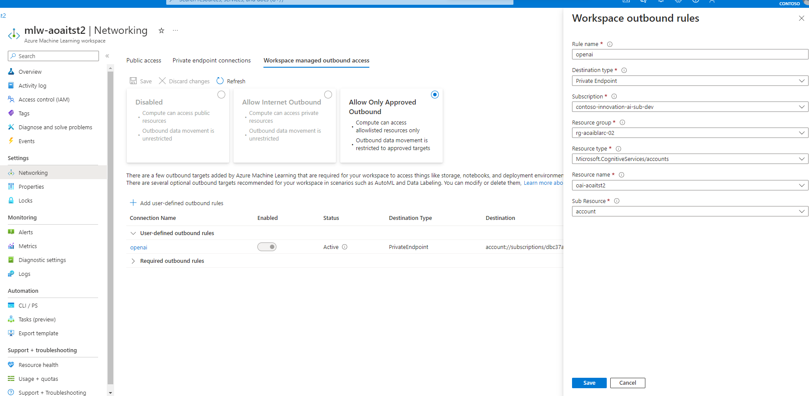
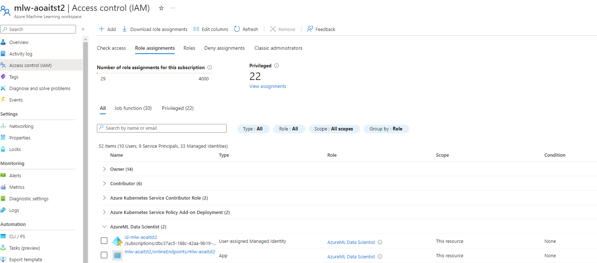

# OpenAI end-to-end baseline reference implementation

This reference implementation illustrates an approach for authoring and running a chat appplication in a single region with Azure Machine Learning and OpenAI. It implements a secure environment for authoring a chat flow with Azure Machine Learning prompt flow and for deploying the flow in 2 environments:

- An Azure Machine Learning managed online endpoint with a compute cluster in a managed virtual network. If your application requires high-availability and you favor Azure Machine Learning compute, it is suggested you extend this architecture to deploy endpoints and compute in multiple regions behind a load balancer.
- A network isolated, zone-redundant, highly available deployment in Azure App Services.

The implementation takes advantage of [Prompt flow](https://microsoft.github.io/promptflow/) in [Azure Machine Learning](https://azure.microsoft.com/products/machine-learning) to build and deploy flows that can link the following actions required by an LLM chat application:

- Creating prompts
- Querying data stores for grounding data
- Python code
- Calling Large Language Models (LLMs)

The reference implementation focuses on enterprise requirements such as:

- Network isolation
- Security
- Scalability
- Zonal redundancy

## Architecture

The implementation covers the following scenarios:

1. Authoring a flow - Authoring a flow using prompt flow in an Azure Machine Learning workspace
1. Deploying a flow to Azure Machine Learning - The deployment of an executable flow to an Azure Machine Learning online endpoint and compute cluster
1. Deploying a flow to Azure App Services - The deployment of an executable flow as a container to Azure App Services

### Authoring a flow


The authoring architecture diagram illustrates how flow authors [connect to an Azure Machine Learning Workspace through a private endpoint](https://learn.microsoft.com/azure/machine-learning/how-to-configure-private-link) in a virtual network. In this case, the author connects to the virtual network through Azure Bastion and a virtual machine jumpbox. Connectivity to the virtual network is more commonly done in enterprises through ExpressRoute or virtual network peering.

The diagram further illustrates how the Machine Learning Workspace is configured for [Workspace managed virtual network isolation](https://learn.microsoft.com/azure/machine-learning/how-to-managed-network). With this configuration, a managed virtual network is created, along with managed private endpoints that enable connectivity to private required resources such as the workplace Azure Storage and Azure Container Registry. You are also able to create user-defined connections like private endpoints to connect to resources like OpenAI and Cognitive Search.

### Deploying a flow to Azure Machine Learning


The Azure Machine Learning deployment architecture diagram illustrates how a network-secured App Service, based on the [App Services Baseline Architecture](https://github.com/Azure-Samples/app-service-baseline-implementation), [connects to a managed online endpoint through a private endpoint](https://learn.microsoft.com/azure/machine-learning/how-to-configure-private-link) in a virtual network. Like the Authoring flow, the diagram illustrates how the Machine Learning Workspace is configured for [Workspace managed virtual network isolation](https://learn.microsoft.com/azure/machine-learning/how-to-managed-network). The deployed flow is able to connect to required resources through managed private endpoints.

### Deploying a flow to Azure App Services


The Azure App Services deployment architecture diagram illustrates how the containerized prompt flow can be deployed to Azure App Services along with the client UI. The Azure App Services deployment is based on the [App Services Baseline Architecture](https://github.com/Azure-Samples/app-service-baseline-implementation). The flow is still authored in a network-isolated Azure Machine Learning workspace. To deploy in App Services in this architecture, the flows need to be containerized and pushed to tht Azure Container Registry accessible through private endpoints to the App Service.

## Deploy

The following are prerequisites.

## Prerequisites

1. Ensure you have an [Azure Account](https://azure.microsoft.com/free/)
1. The deployment must be started by a user who has sufficient permissions to assign [roles](https://learn.microsoft.com/azure/role-based-access-control/built-in-roles), such as a User Access Administrator or Owner.
1. Ensure you have the [Azure CLI installed](https://learn.microsoft.com/cli/azure/install-azure-cli)
1. Ensure you have the [az Bicep tools installed](https://learn.microsoft.com/azure/azure-resource-manager/bicep/install)

Use the following to deploy the infrastructure.

### Deploy the infrastructure

The following steps are required to deploy the infrastructure from the command line.

1. In your command-line tool where you have the Azure CLI and Bicep installed, navigate to the root directory of this repository (AppServicesRI)

1. Login and set subscription if it is needed

```bash
  az login
  az account set --subscription xxxxx
```

1. Obtain App gateway certificate
   Azure Application Gateway support for secure TLS using Azure Key Vault and managed identities for Azure resources. This configuration enables end-to-end encryption of the network traffic using standard TLS protocols. For production systems you use a publicly signed certificate backed by a public root certificate authority (CA). Here, we are going to use a self signed certificate for demonstrational purposes.

   - Set a variable for the domain that will be used in the rest of this deployment.

     ```bash
     export DOMAIN_NAME_APPSERV_BASELINE="contoso.com"
     ```

   - Generate a client-facing, self-signed TLS certificate.

     :warning: Do not use the certificate created by this script for actual deployments. The use of self-signed certificates are provided for ease of illustration purposes only. For your App Service solution, use your organization's requirements for procurement and lifetime management of TLS certificates, _even for development purposes_.

     Create the certificate that will be presented to web clients by Azure Application Gateway for your domain.

     ```bash
     openssl req -x509 -nodes -days 365 -newkey rsa:2048 -out appgw.crt -keyout appgw.key -subj "/CN=${DOMAIN_NAME_APPSERV_BASELINE}/O=Contoso" -addext "subjectAltName = DNS:${DOMAIN_NAME_APPSERV_BASELINE}" -addext "keyUsage = digitalSignature" -addext "extendedKeyUsage = serverAuth"
     openssl pkcs12 -export -out appgw.pfx -in appgw.crt -inkey appgw.key -passout pass:
     ```

   - Base64 encode the client-facing certificate.

     :bulb: No matter if you used a certificate from your organization or you generated one from above, you'll need the certificate (as `.pfx`) to be Base64 encoded for proper storage in Key Vault later.

     ```bash
     export APP_GATEWAY_LISTENER_CERTIFICATE_APPSERV_BASELINE=$(cat appgw.pfx | base64 | tr -d '\n')
     echo APP_GATEWAY_LISTENER_CERTIFICATE_APPSERV_BASELINE: $APP_GATEWAY_LISTENER_CERTIFICATE_APPSERV_BASELINE
     ```

1. Update the infra-as-code/parameters file

```json
{
  "$schema": "https://schema.management.azure.com/schemas/2019-04-01/deploymentParameters.json#",
  "contentVersion": "1.0.0.0",
  "parameters": {
    "baseName": {
      "value": ""
    },
    "developmentEnvironment": {
      "value": true
    },
    "appGatewayListenerCertificate": {
      "value": "[base64 cert data from $APP_GATEWAY_LISTENER_CERTIFICATE_APPSERV_BASELINE]"
    }
  }
}
```

1. Run the following command to create a resource group and deploy the infrastructure. Make sure:

   - The location you choose [supports availability zones](https://learn.microsoft.com/azure/reliability/availability-zones-service-support)
   - The BASE_NAME contains only lowercase letters and is between 6 and 12 characters. All resources will be named given this basename.
   - You choose a valid resource group name

```bash
   export LOCATION=eastus
   export BASE_NAME=<base-resource-name (between 3 and 6 lowercase characters)>

   RESOURCE_GROUP=<resource-group-name>
   az group create --location $LOCATION --resource-group $RESOURCE_GROUP

   az deployment group create --template-file ./infra-as-code/bicep/main.bicep \
     --resource-group $RESOURCE_GROUP \
     --parameters @./infra-as-code/bicep/parameters.json \
     --parameters baseName=$BASE_NAME
```

1. TEMPORARY - Set public network access to 'All networks' for the Azure Container Registry and the machine learning Storage Account. There is a known bug that requires these to be accessible publicly.

## Create, test, and deploy a Prompt flow

1. Connect to the virtual network via Azure Bastion and a Virtual Machine jumpbox or through VNet peering. 'Windows 11 Pro, version 22H2 - x64 Gen2' is a suitable jumpbox VM image.

1. Open the [Machine Learning Workspace](https://ml.azure.com/) and choose your workspace. Ensure you have [enabled Prompt flow in your Azure Machine Learning workspace](https://learn.microsoft.com/azure/machine-learning/prompt-flow/get-started-prompt-flow?view=azureml-api-2#prerequisites-enable-prompt-flow-in-your-azure-machine-learning-workspace).

1. Create a new Prompt flow with a single python step and save the flow.  **Important: make sure the input name is 'question' and output name on the flow is 'answer'. If your input or output names differ, change the chatInputName or chatOutputName environment variables for the web app either in the Bicep or in the deployed App Service.*

```python
from promptflow import tool

@tool
def process_search_result(search_result):
    
    try:
       return search_result+"Echo"
    except Exception as e:
        return "error"
```

1. Add runtime 

   - Click Add runtime
   - Add compute instance runtime and give it a name
   - Choose the compute instance created by the Bicep  *TODO ==> existing instance? I had to creat a new ONE
   - Accept the other defaults and click 'Create'

1. Test the flow

   - Wait for the runtime to be created
   - Select the runtime in the UI
   - Click on Chat
   - Enter a question
   - The response should echo your question with 'Echo' appended

## Create a deployment

1. Create a deployment in the UI

   - Click on 'Deploy' in the UI
   - Choose 'Existing' Endpoint and select the one called _ept-<basename>_
   - Choose Next and name the deployment ept-<basename>, leaving the defaults on the Deployment screen. **Make sure you name the deployment ept-<basename>. An App Service environment variable is set, assuming that naming convention**
   - Choose Next, Next, Next
   - Choose a small Virtual Machine size for testing and set the number of instances.
   - Deploy

### Publish the web app

The baseline architecture uses [run from zip file in App Services](https://learn.microsoft.com/azure/app-service/deploy-run-package). There are many benefits of using this approach, including eliminating file lock conflicts when deploying.

To use run from zip, you do the following:

1. Create a [project zip package](https://learn.microsoft.com/azure/app-service/deploy-run-package#create-a-project-zip-package) which is a zip file of your project.
1. Upload that zip file to a location that is accessible to your web site. This implementation uses private endpoints to securely connect to the storage account. The web app has a managed identity that is authorized to access the blob.
1. Set the environment variable `WEBSITE_RUN_FROM_PACKAGE` to the URL of the zip file.

In a production environment, you would likely use a CI/CD pipeline to:

1. Build your application
1. Create the project zip package
1. Upload the zip file to your storage account

The CI/CD pipeline would likely use a [self-hosted agent](https://learn.microsoft.com/azure/devops/pipelines/agents/agents?view=azure-devops&tabs=browser#install) that is able to connect to the storage account through a private endpoint to upload the zip. We have not implemented that here.

**Workaround**

Because we have not implemented a CI/CD pipeline with a self-hosted agent, we need a workaround to upload the file to the storage account. There are two workaround steps you need to do in order to manually upload the zip file using the portal.

1. The deployed storage account does not allow public access, so you will need to temporarily allow access public access from your IP address.
1. You need to give your user permissions to upload a blob to the storage account.

Run the following to:

- Allow public access from your IP address.
- Give the logged in user permissions to upload a blob
- Upload the zip file `./website/chatui.zip` to the existing `deploy` container
- Tell the web app to restart

```bash
CLIENT_IP_ADDRESS=<your-public-ip-address>

STORAGE_ACCOUNT_PREFIX=st
WEB_APP_PREFIX=app-
NAME_OF_STORAGE_ACCOUNT="$STORAGE_ACCOUNT_PREFIX$BASE_NAME"
NAME_OF_WEB_APP="$WEB_APP_PREFIX$BASE_NAME"
LOGGED_IN_USER_ID=$(az ad signed-in-user show --query id -o tsv)
RESOURCE_GROUP_ID=$(az group show --resource-group $RESOURCE_GROUP --query id -o tsv)
STORAGE_BLOB_DATA_CONTRIBUTOR=ba92f5b4-2d11-453d-a403-e96b0029c9fe

az storage account network-rule add -g $RESOURCE_GROUP --account-name "$NAME_OF_STORAGE_ACCOUNT" --ip-address $CLIENT_IP_ADDRESS
az role assignment create --assignee-principal-type User --assignee-object-id $LOGGED_IN_USER_ID --role $STORAGE_BLOB_DATA_CONTRIBUTOR --scope $RESOURCE_GROUP_ID

az storage blob upload -f ./website/chatui.zip \
  --account-name $NAME_OF_STORAGE_ACCOUNT \
  --auth-mode login \
  -c deploy -n chatui.zip

az webapp restart --name $NAME_OF_WEB_APP --resource-group $RESOURCE_GROUP
```

### Validate the web app

This section will help you to validate the workload is exposed correctly and responding to HTTP requests.

### Steps

1. Get the public IP address of Application Gateway.

   > :book: The app team conducts a final acceptance test to be sure that traffic is flowing end-to-end as expected, so they place a request against the Azure Application Gateway endpoint.

   ```bash
   # query the Azure Application Gateway Public Ip
   APPGW_PUBLIC_IP=$(az network public-ip show --resource-group $RESOURCE_GROUP --name "pip-$BASE_NAME" --query [ipAddress] --output tsv)
   echo APPGW_PUBLIC_IP: $APPGW_PUBLIC_IP
   ```

1. Create an `A` record for DNS.

   > :bulb: You can simulate this via a local hosts file modification. You're welcome to add a real DNS entry for your specific deployment's application domain name, if you have access to do so.

   Map the Azure Application Gateway public IP address to the application domain name. To do that, please edit your hosts file (`C:\Windows\System32\drivers\etc\hosts` or `/etc/hosts`) and add the following record to the end: `${APPGW_PUBLIC_IP} www.${DOMAIN_NAME_APPSERV_BASELINE}` (e.g. `50.140.130.120  www.contoso.com`)

1. Browse to the site (e.g. <https://www.contoso.com>).

   > :bulb: Remember to include the protocol prefix `https://` in the URL you type in the address bar of your browser. A TLS warning will be present due to using a self-signed certificate. You can ignore it or import the self-signed cert (`appgw.pfx`) to your user's trusted root store.

## Clean Up

After you are done exploring your deployed AppService reference implementation, you'll want to delete the created Azure resources to prevent undesired costs from accruing.

```bash
az group delete --name $RESOURCE_GROUP -y
az keyvault purge  -n kv-${BASE_NAME}
```


# Authoring Experience

 - A new Flow with LLM AzureOpen AI
 - Configure a connection to Azure OpenAI in the Flow
 - Add a User-defined outbound rule to ML Workspace to allow connectivity to Azure OpenAI private endpoint
  
 - Add AzureML Data Scientist to your published Endpoint
 -  


# Build a docker container for the flow

Using Azure ML Studio save the flow as a file
Create a new folder called /connections
add the file for the connection, for example AzureOpenAIConnection.yaml with the following content:

$schema: https://azuremlschemas.azureedge.net/promptflow/latest/AzureOpenAIConnection.schema.json
name: OpenAIConnection
type: azure_open_ai
api_key: "" ==> Replace with your own values
api_base: "" ==> Replace with your own values
api_type: "azure"
api_version: "2023-07-01-preview"

you should have python, promptflow, wsl, docker installed (WSL is needed to build docker image).

# Create a new promptflow connection

pf connection create -f '.\AzureOpenAIConnection yaml'                               

generate the docker container configurationb using promptflow

pf flow build --source ./  --output dist --format docker                             

it will generate files in the /dist folder of the flow

once that is done go inside that folder to modify the environment variables needed (you can find a complete example in the flows folder) 

In your Azure Container Registry, allow public access or add your machine ip to the allowed ip list then do the following steps

# Build docker image locally 

In your development environment or local machine, login into acr using the admin credentials of your ACR

docker login -u ${user_name} ${private_registry_domain} 


docker build . -t craoaitst2.azurecr.io/aoai/testflow:1.1

docker push . -t craoaitst2.azurecr.io/aoai/testflow:1.1


# Deploy image to web app

image is available inside ACR for deployment you can use the following command to update your app service to pull image from container:

Activate admin user in ACR

- Update the Azure Web App configuration to use the image from your ACR:

az webapp config container set --name "app-aoaitst2-pf" --resource-group "rg-aoaiblarc-02" --docker-custom-image-name craoaitst2.azurecr.io/aoai/testflow:1.1 --docker-registry-server-url https://craoaitst2.azurecr.io --docker-registry-server-user craoaitst2 --docker-registry-server-password <yourpwd>

az webapp deployment container config --enable-cd true --name "app-aoaitst2-pf" --resource-group "rg-aoaiblarc-02"

# Modify the configuration setting in the app service that has the chat ui and point it towards your deployed promptflow endpoint:

chatApiEndpoint = <yourendpoint.azurewebsites.net/score>

Restart the azure webapp


