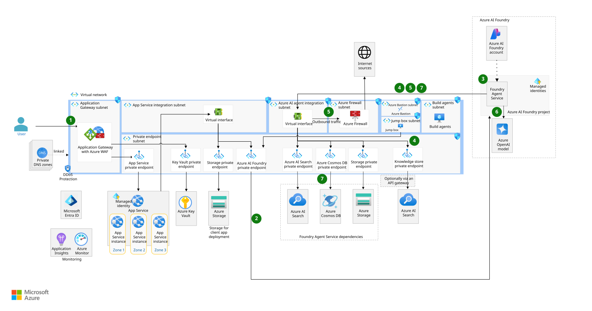

# Microsoft Foundry Agent Service chat baseline reference implementation

This reference implementation illustrates an approach running a chat application and an AI orchestration layer in a single region. It uses Microsoft Foundry Agent Service as the agent orchestrator and OpenAI foundation models. This repository directly supports the [Baseline end-to-end chat reference architecture](https://learn.microsoft.com/azure/architecture/ai-ml/architecture/baseline-microsoft-foundry-chat) on Microsoft Learn.

Follow this implementation to deploy an agent in [Microsoft Foundry](https://learn.microsoft.com/azure/foundry/) and uses Bing for grounding data. You'll be exposed to common generative AI chat application characteristics such as:

- Creating agents and agent prompts
- Querying data stores for grounding data
- Chat memory database
- Orchestration logic
- Calling language models (such as GPT models) from your agent

This implementation builds off the [basic implementation](https://github.com/Azure-Samples/microsoft-foundry-basic), and adds common production requirements such as:

- Network isolation
- Bring-your-own Foundry Agent Service dependencies (for security and BC/DR control)
- Added availability zone reliability
- Limit egress network traffic with Azure Firewall

## Architecture

The implementation covers the following scenarios:

- [Setting up Microsoft Foundry to host agents](#setting-up-microsoft-foundry-to-host-agents)
- [Deploying an agent into Foundry Agent Service](#deploying-an-agent-into-microsoft-foundry-agent-service)
- [Invoking the agent from .NET code hosted in an Azure Web App](#invoking-the-agent-from-net-code-hosted-in-an-azure-web-app)

### Setting up Microsoft Foundry to host agents

Microsoft Foundry hosts Foundry Agent Service as a capability. Foundry Agent service's REST APIs are exposed as a Foundry private endpoint within the network, and the agents' all egress through a delegated subnet which is routed through Azure Firewall for any internet traffic. This architecture deploys the Foundry Agent Service with its dependencies hosted within your own Azure subscription. As such, this architecture includes an Azure Storage account, Azure AI Search instance, and an Azure Cosmos DB account specifically for the Foundry Agent Service to manage.



*Download a [Visio file](docs/media/baseline-azure-ai-foundry.vsdx) of this architecture.*

#### Workflow

1. An application user interacts with a chat UI. The requests are routed through Azure Application Gateway. Azure Web Application Firewall inspects these requests before it forwards them to the back-end App Service.
1. When the web application receives a message, it passes it along with the conversation ID to the Foundry prompt-based agent through the [Microsoft Agent Framework](https://github.com/microsoft/agent-framework), which calls the [OpenAI Conversations](https://ai.azure.com/api-reference/conversations/create-conversation/) and [Responses](https://ai.azure.com/api-reference/responses/create-response/) APIs under the hood. The web application calls the agent over a private endpoint and authenticates to Foundry by using its managed identity.
1. The agent processes the user's request based on the instructions in its system prompt. To fulfill the user's intent, the agent uses a configured language model and connected tools and knowledge stores.
1. The agent connects to the knowledge store (Azure AI Search) in the private network via a private endpoint.
1. Requests to most external knowledge stores or tools, such as Wikipedia, traverse Azure Firewall for inspection and egress policy enforcement. Some of Foundry's built-in connections might not support egressing through your subnet.
1. The agent connects to its configured language model and passes relevant context.
1. Before the agent returns the response to the UI, it persists the request, the generated response, and a list of consulted knowledge stores into a dedicated memory database. This database maintains the complete conversation history, which enables context-aware interactions and allows users to resume conversations with the agent without losing prior context.

### Deploying an agent into Microsoft Foundry Agent service

Project-scoped agents are created and managed through the Foundry [Agents REST API](https://ai.azure.com/api-reference/agents/), which is the underlying primitive for agent lifecycle operations. The Microsoft Foundry portal and the [Foundry SDK](https://github.com/Azure/azure-sdk-for-net/tree/main/sdk/ai/Azure.AI.Projects) consume this API. Since the data plane to Foundry is private, all of these operations are restricted to being executed from within a private network connected to the private endpoint of Foundry.

Ideally agents should be source-controlled and a versioned asset. You then can deploy agents in a coordinated way with the rest of your workload's code. In this deployment guide, you'll create an agent from the jump box to simulate a deployment pipeline which could have created the agent.

If using the Foundry portal is desired, then the web browser experience must be performed from a VM within the network or from a workstation that has VPN access to the private network and can properly resolve private DNS records.

### Invoking the agent from .NET code hosted in an Azure Web App

A chat UI application is deployed into a private Azure App Service. The UI is accessed through Application Gateway (WAF). The .NET code uses the [Microsoft Agent Framework](https://github.com/microsoft/agent-framework) with the Foundry provider to connect to the workload's agent through the project-scoped endpoint. At this scope, applications can choose between Microsoft Agent Framework or the [Foundry SDK](https://github.com/Azure/azure-sdk-for-net/tree/main/sdk/ai/Azure.AI.Projects). The project-scoped endpoint is accessed through the Foundry private endpoint within the virtual network.

Agent invocation at runtime uses a different API surface than agent lifecycle management. [Microsoft Agent Framework](https://github.com/microsoft/agent-framework) uses exclusively the [OpenAI Conversations](https://ai.azure.com/api-reference/conversations/create-conversation/) and [Responses](https://ai.azure.com/api-reference/responses/create-response/) APIs, identifying the agent by name and version directly in the request body.

## Deployment guide

Follow these instructions to deploy this example to your Azure subscription, try out what you've deployed, and learn how to clean up those resources.

### Prerequisites

- An [Azure subscription](https://azure.microsoft.com/free/)

  - The subscription must have all of the resource providers used in this deployment [registered](https://learn.microsoft.com/azure/azure-resource-manager/management/resource-providers-and-types#register-resource-provider).

    - `Microsoft.AlertsManagement`
    - `Microsoft.App`
    - `Microsoft.Bing`
    - `Microsoft.CognitiveServices`
    - `Microsoft.Compute`
    - `Microsoft.DocumentDB`
    - `Microsoft.Insights`
    - `Microsoft.KeyVault`
    - `Microsoft.ManagedIdentity`
    - `Microsoft.Network`
    - `Microsoft.OperationalInsights`
    - `Microsoft.Search`
    - `Microsoft.Storage`
    - `Microsoft.Web`

  - The subscription must have the following quota and SKU availability in the region you choose.

    - Application Gateways: 1 WAF_v2 tier instance
    - App Service Plans: P1v3 (AZ), 3 instances
    - Azure AI Search (S - Standard): 1
    - Azure Cosmos DB: 1 account
    - OpenAI model: GPT-5.4 model deployment with 50k tokens per minute (TPM) capacity
    - DDoS Protection Plans: 1
    - Public IPv4 Addresses - Standard: 4
    - Standard DSv3 Family vCPU: 2
    - Grounding with Bing (G1): 1
    - Storage Account (Standard_ZRS): 1
    - Storage Account (Standard_GZRS): 1

- Your deployment user must have the following permissions at the subscription scope.

  - Ability to assign [Azure roles](https://learn.microsoft.com/azure/role-based-access-control/built-in-roles) on newly created resource groups and resources. (E.g. `User Access Administrator` or `Owner`)
  - Ability to purge deleted AI services resources. (E.g. `Contributor` or `Cognitive Services Contributor`)

- The [Azure CLI installed](https://learn.microsoft.com/cli/azure/install-azure-cli)

  > :bulb: If you're executing this from Windows Subsystem for Linux (WSL), be sure the Azure CLI is installed in WSL and is not using the version installed in Windows. `which az` must show `/usr/bin/az`.

- The [OpenSSL CLI](https://docs.openssl.org/3.5/man7/ossl-guide-introduction/#getting-and-installing-openssl) installed.

### 1. :rocket: Deploy the infrastructure

The following steps are required to deploy the infrastructure from the command line using the bicep files from this repository.

1. In your shell, clone this repo and navigate to the root directory of this repository.

   ```bash
   git clone https://github.com/Azure-Samples/microsoft-foundry-baseline
   cd microsoft-foundry-baseline
   ```

1. Log in and select your target subscription.

   ```bash
   az login
   az account set --subscription xxxxx
   ```

1. Obtain the App gateway certificate

   Azure Application Gateway includes support for secure TLS using Azure Key Vault and managed identities for Azure resources. This configuration enables end-to-end encryption of the network traffic going to the web application.

   - Set a variable for the domain used in the rest of this deployment.

     ```bash
     DOMAIN_NAME_APPSERV="contoso.com"
     ```

   - Generate a client-facing, self-signed TLS certificate.

     > :warning: Do not use the certificate created by this script for production deployments. The use of self-signed certificates are provided for ease of illustration purposes only. For your chat application traffic, use your organization's requirements for procurement and lifetime management of TLS certificates, *even for development purposes*.

     Create the certificate that will be presented to web clients by Azure Application Gateway for your domain.

     ```bash
     openssl req -x509 -nodes -days 365 -newkey rsa:2048 -out appgw.crt -keyout appgw.key -subj "/CN=www.${DOMAIN_NAME_APPSERV}/O=Contoso" -addext "subjectAltName = DNS:www.${DOMAIN_NAME_APPSERV}" -addext "keyUsage = digitalSignature" -addext "extendedKeyUsage = serverAuth"
     openssl pkcs12 -export -out appgw.pfx -in appgw.crt -inkey appgw.key -passout pass:
     ```

   - Base64 encode the client-facing certificate.

     :bulb: No matter if you used a certificate from your organization or generated one from above, you'll need the certificate (as `.pfx`) to be Base64 encoded for storage in Key Vault.

     ```bash
     APP_GATEWAY_LISTENER_CERTIFICATE_APPSERV=$(cat appgw.pfx | base64 | tr -d '\n')
     echo APP_GATEWAY_LISTENER_CERTIFICATE_APPSERV: $APP_GATEWAY_LISTENER_CERTIFICATE_APPSERV
     ```

1. Set the deployment location to one that [supports availability zones](https://learn.microsoft.com/azure/reliability/availability-zones-service-support) and has available quota.

   This deployment has been tested in the following locations: `eastus`, `eastus2`, `francecentral`, `swedencentral`, and `switzerlandnorth`. You might be successful in other locations as well.

   ```bash
   LOCATION=eastus2
   ```

1. Set the base name value that will be used as part of the Azure resource names for the resources deployed in this solution.

   ```bash
   BASE_NAME=<base resource name, between 6 and 8 lowercase characters, all DNS names will include this text, so it must be unique.>
   ```

1. Create a resource group and deploy the infrastructure.

   *There is an optional tracking ID on this deployment. To opt out of its use, add the following parameter to the deployment code below: `-p telemetryOptOut true`.*

   You will be prompted for an admin password for the jump box; it must satisfy the [complexity requirements for Windows](https://learn.microsoft.com/windows/security/threat-protection/security-policy-settings/password-must-meet-complexity-requirements).

   :clock8: *This might take about 35 minutes.*

   ```bash
   RESOURCE_GROUP=rg-chat-baseline-${BASE_NAME}
   az group create -l $LOCATION -n $RESOURCE_GROUP

   PRINCIPAL_ID=$(az ad signed-in-user show --query id -o tsv)

   az deployment group create -f ./infra-as-code/bicep/main.bicep \
     -g $RESOURCE_GROUP \
     -p appGatewayListenerCertificate=${APP_GATEWAY_LISTENER_CERTIFICATE_APPSERV} \
     -p baseName=${BASE_NAME} \
     -p yourPrincipalId=${PRINCIPAL_ID}
   ```

### 2. Deploy an agent in the Microsoft Foundry Agent Service

To test this scenario, you'll be deploying an AI agent included in this repository. The agent uses a GPT model combined with a Bing search for grounding data. Deploying an AI agent requires data plane access to Foundry. In this architecture, a network perimeter is established, and you must interact with the Foundry portal and its resources from within the network.

The AI agent definition would likely be deployed from your application's pipeline running from a build agent in your workload's network or it could be deployed via singleton code in your web application. In this deployment, you'll create the agent from the jump box, which most closely simulates pipeline-based creation.

1. Connect to the virtual network via the deployed [Azure Bastion and the jump box](https://learn.microsoft.com/azure/bastion/bastion-connect-vm-rdp-windows#rdp). Alternatively, you can connect through a force-tunneled VPN or virtual network peering that you manually configure apart from these instructions.

   The username for the Windows jump box deployed in this solution is `vmadmin`. You provided the password during the deployment.

   | :computer: | Unless otherwise noted, the following steps are performed from the jump box or from your VPN-connected workstation. The instructions are written as if you are using the provided Windows jump box.|
   | :--------: | :------------------------- |

1. Open PowerShell from the Terminal app. Log in and select your target subscription.

   ```powershell
   az login
   az account set --subscription xxxxx
   ```

1. Set the base name to the same value it was when you deployed the resources.

   ```powershell
   $BASE_NAME="<exact same value used before>"
   ```

1. Generate some variables to set context within your jump box.

   *The following variables align with the defaults in this deployment. Update them if you customized anything.*

   ```powershell
   $RESOURCE_GROUP="rg-chat-baseline-${BASE_NAME}"
   $FOUNDRY_NAME="aif${BASE_NAME}"
   $BING_CONNECTION_NAME="bingaiagent${BASE_NAME}"
   $FOUNDRY_PROJECT_NAME="projchat"
   $MODEL_CONNECTION_NAME="agent-model"
   $BING_CONNECTION_ID="$(az cognitiveservices account show -n $FOUNDRY_NAME -g $RESOURCE_GROUP --query 'id' --out tsv)/projects/${FOUNDRY_PROJECT_NAME}/connections/${BING_CONNECTION_NAME}"
   $FOUNDRY_AGENT_URL="https://${FOUNDRY_NAME}.services.ai.azure.com/api/projects/${FOUNDRY_PROJECT_NAME}/agents?api-version=v1"

   echo $BING_CONNECTION_ID
   echo $MODEL_CONNECTION_NAME
   echo $FOUNDRY_AGENT_URL
   ```

1. Create the agent.

   *This step provisions a long-lived AI agent from your jump box. This simulates a network-connected build agent performing in your pipeline.*

   ```powershell
   # Use the agent definition on disk
   Invoke-WebRequest -Uri "https://github.com/Azure-Samples/microsoft-foundry-baseline/raw/refs/heads/main/agents/chat-with-bing.json" -OutFile "chat-with-bing.json"

   # Update to match your environment
   $chat_agent = Get-Content .\chat-with-bing.json -Raw | ConvertFrom-Json

   $chat_agent.definition.model = $MODEL_CONNECTION_NAME
   $chat_agent.definition.tools[0].bing_grounding.search_configurations[0].project_connection_id = $BING_CONNECTION_ID

   $AGENT_BODY = $chat_agent | ConvertTo-Json -Depth 10 -Compress
   $AGENT_BODY = $AGENT_BODY -replace '":','": '
   $AGENT_BODY = $AGENT_BODY.Replace('"','\"')

   # Persist the agent
   az rest -u $FOUNDRY_AGENT_URL -m "post" --resource "https://ai.azure.com" -b $AGENT_BODY

   # Capture the agent's name and latest version
   $AGENT_RESPONSE=$(az rest -u $FOUNDRY_AGENT_URL -m 'get' --resource 'https://ai.azure.com' -o json)
   $AGENT_ID=$($AGENT_RESPONSE | ConvertFrom-Json).last_id
   $AGENT_VERSION=$($AGENT_RESPONSE | ConvertFrom-Json).data[-1].versions.latest.version

   echo "$AGENT_ID (version $AGENT_VERSION)"
   ```

   | :information: | You’ve just persisted a new versioned agent in Foundry AI Agent Service, including its instructions, tools, and model. The platform has stored a canonical agent definition in the `enterprise_memory` database, making the agent addressable, executable and ready for evaluation.|
   | :-------: | :------------------------- |

### 3. Test the agent from the Foundry portal in the playground. *Optional.*

Here you'll test your Foundry orchestration agent by invoking it directly from the Foundry portal's playground experience. The Foundry portal is only accessible from your private network, so you'll do this from your jump box.

*This testing step is completely optional.*

1. Open the Azure portal to your subscription.

   You'll need to sign in to the Azure portal, and resolve any Entra ID Conditional Access policies on your account, if this is the first time you are connecting through the jump box.

1. Navigate to the Foundry project named **projchat** in your resource group and open the Foundry portal by clicking the **Go to Foundry portal** button.

   This will take you directly into the 'Chat project'. Alternatively, you can find all your Foundry accounts and projects by going to <https://ai.azure.com> and you do not need to use the Azure portal to access them.

1. In the upper-right corner, if not already enabled, toggle New Foundry to switch into the Microsoft Foundry (new) portal.

1. In the top-right corner, click Build. This opens by default the Agents blade in the side navigation, where you can view the available agents and create new ones.

1. Select the agent you just created from the previous step named 'baseline-chatbot-agent'.

1. Enter a question to the agent that would require grounding data through recent internet content, such as a notable recent event or the weather today in your location.

1. A grounded response to your question should appear on the UI.

### 4. Publish the chat front-end web app

Workloads build chat functionality into an application. Those interfaces usually call APIs which in turn call into your Foundry agent orchestrator. This implementation comes with such an interface. You'll deploy it to Azure App Service using its [run from package](https://learn.microsoft.com/azure/app-service/deploy-run-package) capabilities.

In a production environment, you use a CI/CD pipeline to:

- Build your web application
- Create the project zip package
- Upload the zip file to your Storage account from compute that is in or connected to the workload's virtual network.

For this deployment guide, you'll continue using your jump box to simulate part of that process.

1. Using the same PowerShell terminal session from previous steps, download the web UI.

   ```powershell
   Invoke-WebRequest -Uri https://github.com/Azure-Samples/microsoft-foundry-baseline/raw/refs/heads/main/website/chatui.zip -OutFile chatui.zip
   ```

1. *(Recommended)* Verify the integrity of the downloaded zip file before uploading.

   From your **local workstation** (bash):

   ```bash
   sha256sum website/chatui.zip
   ```

   From the **jump box** (PowerShell):

   ```powershell
   (Get-FileHash chatui.zip -Algorithm SHA256).Hash
   ```

   Both outputs should match the same SHA-256 hash.

1. Upload the web application to Azure Storage, where the web app will load the code from.

   ```powershell
   az storage blob upload -f chatui.zip --account-name "stwebapp${BASE_NAME}" --auth-mode login -c deploy -n chatui.zip
   ```

1. Update the app configuration to use the agent you deployed.

   ```powershell
   az webapp config appsettings set -n "app-${BASE_NAME}" -g $RESOURCE_GROUP --settings AIAgentId="${AGENT_ID}" AIAgentVersion="${AGENT_VERSION}"
   ```

1. Restart the web app to load the site code and its updated configuration.

   ```powershell
   az webapp restart --name "app-${BASE_NAME}" --resource-group $RESOURCE_GROUP
   ```

### 5. Try it out! Test the deployed application that calls into the Foundry Agent Service

This section will help you to validate that the workload is exposed correctly and responding to HTTP requests. This will validate that traffic is flowing through Application Gateway, into your Web App, and from your Web App, into the Foundry agent API endpoint, which hosts the agent and its chat history. The agent will interface with Bing for grounding data and an OpenAI model for generative responses.

| :computer: | Unless otherwise noted, the following steps are all performed from your original workstation, not from the jump box. |
| :--------: | :------------------------- |

1. Get the public IP address of the Application Gateway.

   ```bash
   # Query the Azure Application Gateway Public IP
   APPGW_PUBLIC_IP=$(az network public-ip show -g $RESOURCE_GROUP -n "pip-$BASE_NAME" --query [ipAddress] --output tsv)
   echo APPGW_PUBLIC_IP: $APPGW_PUBLIC_IP
   ```

1. Create an `A` record for DNS.

   > :bulb: You can simulate this via a local hosts file modification.  Alternatively, you can add a real DNS entry for your specific deployment's application domain name if permission to do so.

   Map the Azure Application Gateway public IP address to the application domain name. To do that, please edit your hosts file (`C:\Windows\System32\drivers\etc\hosts` or `/etc/hosts`) and add the following record to the end: `${APPGW_PUBLIC_IP} www.${DOMAIN_NAME_APPSERV}` (e.g. `50.140.130.120  www.contoso.com`)

1. Browse to the site (e.g. <https://www.contoso.com>).

   > :bulb: It may take up to a few minutes for the App Service to start properly. Remember to include the protocol prefix `https://` in the URL you type in your browser's address bar. A TLS warning will be present due to using a self-signed certificate. You can ignore it or import the self-signed cert (`appgw.pfx`) to your user's trusted root store.

   Once you're there, ask your solution a question. Your question should involve something that would only be known if the RAG process included context from Bing such as recent weather or events.

## :broom: Clean up resources

Most Azure resources deployed in the prior steps will incur ongoing charges unless removed. This deployment is typically over $90 a day, and more if you enabled Azure DDoS Protection. Promptly delete resources when you are done using them.

Additionally, a few of the resources deployed enter soft delete status which will restrict the ability to redeploy another resource with the same name or DNS entry; and might not release quota. It's best to purge any soft deleted resources once you are done exploring. Use the following commands to delete the deployed resources and resource group and to purge each of the resources with soft delete.

1. Delete the resource level locks for Foundry project capability host dependencies

   ```bash
   az lock delete -g $RESOURCE_GROUP --resource-type 'Microsoft.Storage/storageAccounts' --resource stagent${BASE_NAME} -n stagent${BASE_NAME}-lock
   az lock delete -g $RESOURCE_GROUP --resource-type 'Microsoft.DocumentDB/databaseAccounts' --resource cdb-ai-agent-threads-${BASE_NAME} -n cdb-ai-agent-threads-${BASE_NAME}-lock
   az lock delete -g $RESOURCE_GROUP --resource-type 'Microsoft.Search/searchServices' --resource ais-ai-agent-vector-store-${BASE_NAME} -n ais-ai-agent-vector-store-${BASE_NAME}-lock
   ```

1. Delete the resource group as a way to delete all contained Azure resources.

   | :warning: | This will completely delete any data you may have included in this example. That data and this deployment will be unrecoverable. |
   | :-------: | :------------------------- |

   :clock8: *This might take about 20 minutes.*

   ```bash
   # This command will delete most of the resources, but will sometimes error out. That's expected.
   az group delete -n $RESOURCE_GROUP -y

   # Continue, even if the previous command errored.
   ```

1. Purge soft-deleted resources.

   ```bash
   # Purge the soft delete resources.
   az keyvault purge -n kv-${BASE_NAME} -l $LOCATION
   az cognitiveservices account purge -g $RESOURCE_GROUP -l $LOCATION -n aif${BASE_NAME}
   ```

1. [Remove the Azure Policy assignments](https://portal.azure.com/#blade/Microsoft_Azure_Policy/PolicyMenuBlade/Compliance) scoped to the resource group. To identify those created by this implementation, look for ones that are prefixed with `[BASE_NAME] `.

> [!TIP]
> The `vnet-workload` and associated networking resources are sometimes blocked from being deleted with the above instructions. This is because the Foundry Agent Service subnet (`snet-agentsEgress`) retains a latent Microsoft-managed delegated connection (`serviceAssociationLink`) to the deleted Foundry Agent Service backend. The virtual network and associated resources typically become free to delete about an hour after purging the Foundry account.
>
> The lingering resources do not have a cost associated with them existing in your subscription.
>
> If the resource group didn't fully delete, re-execute the `az group delete -n $RESOURCE_GROUP -y` command after an hour to complete the cleanup.

## Production readiness changes

The infrastructure as code included in this repository has a few configurations that are made only to enable a smoother and less expensive deployment experience when you are first trying this implementation out. These settings are not recommended for production deployments, and you should evaluate each of the settings before deploying to production. Those settings all have a comment next to them that starts with `Production readiness change:`.

## Contributions

Please see our [Contributor guide](./CONTRIBUTING.md).

This project has adopted the [Microsoft Open Source Code of Conduct](https://opensource.microsoft.com/codeofconduct/). For more information see the [Code of Conduct FAQ](https://opensource.microsoft.com/codeofconduct/faq/) or contact <opencode@microsoft.com> with any additional questions or comments.

With :heart: from Azure Patterns & Practices, [Azure Architecture Center](https://azure.com/architecture).